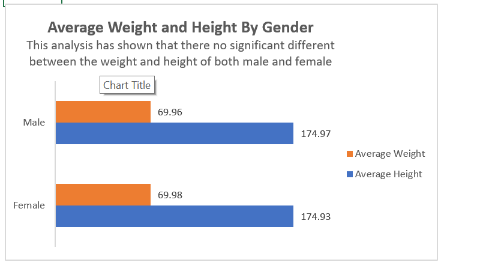

# Medical Student Record Analysis

## Introduction
This is an Excel Project on the medical records of some medical student,  We have 13 rows and 2000000 columns. This analysis Project is to help  us understand more about the student body and gain more insight about there health.

**_Disclamier_** : _All Dataset do not represent any individual, institution or company ,but just a dummy set to demonstrate my knowledge of Excel._

## Problem Statement

1. Average values for the following for Male and Females (Age, BMI, Temperature, Heart Rate, Blood Pressure, and Cholesterol).
2. 	Average Height and Weight for both Genders (in 2 decimal places).
3. 	Number of students across the different Blood Groups
4. Number of Students who smoke and those who don’t.
5. Number of Students who have diabetes and those who don’t.
   
## Skill /Concepts Documented:

The following Excel Features were incorporated;
-	Data Cleaning,
-	Flash Fill,
-	Find and Replace,
-	The use of excel formular; Average, Sum,
-	Pivot Table For Analysi,s
- Pivot chart for visualization.

# Data Cleaning
There were some empty space in the all the row in the dataset,I was able able to fill each rolls by;
. Student ID: Use Flash and Fill to fill 1-200000
. Age: Find Average Age to fill all the empty age
. Gender: Fill all empty space with female .
. Height and weight: Find the Average of each to space fill up the empty space.
. Blood Type : Fill the empty space with Blood Type “O”.
. BMI, Temperature, Heart Rate, Blood Pressure and cholesterol: Find the average of each and fill up each with the average.
. Diabetes and Smoking: The empty space was filled with “Unspecified”

## Analysis and Visualization

Average BMI,Age,Cholestrol,Blood Pressure,Temperature;
 Analysis                                                           |     Visuals
:-------------------------------------------------------------:    |    :-------------------------------------------------------------:
                            |       

Average Weight and Height
Analysis                                                            |     Visuals
:-------------------------------------------------------------:    |    :-------------------------------------------------------------:
                            |       

Number of students across Blood Type
Analysis                                                            |     Visuals
:-------------------------------------------------------------:       |    :-------------------------------------------------------------:
                                          |       

Number of students who smoke and who does not
Analysis                                                            |     Visuals
:-------------------------------------------------------------:    |    :-------------------------------------------------------------:
                                           |       

Number of students who has Diabetes and who does not
Analysis                                                            |     Visuals
:-------------------------------------------------------------:    |    :-------------------------------------------------------------:
                                           |       

# Conclusion
The Empty space in the dataset was too much, and because of this we were not able to get an accurate analysis.The Dataset should be completed to get a significant analysis.

